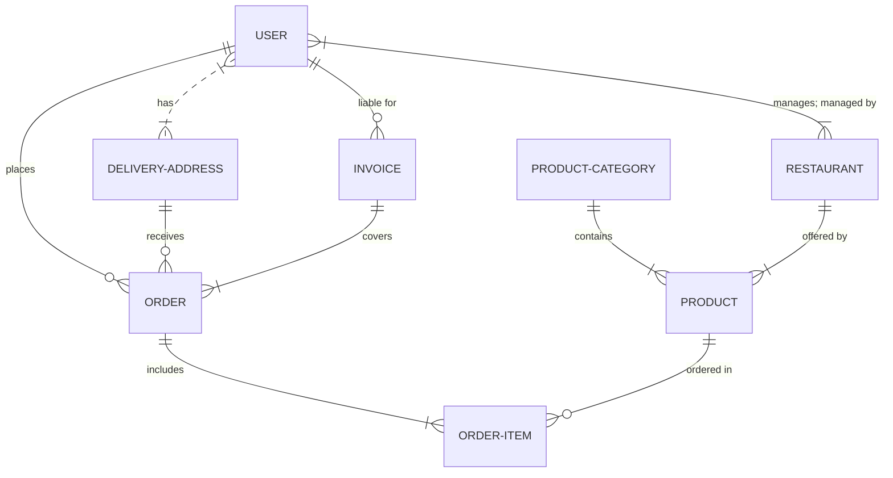

# ER Diagram (mermaid syntax)

under construction...

```mermaid
erDiagram
          USER }|--|{ RESTAURANT : "manages;  managed by"
          USER }|..|{ DELIVERY-ADDRESS : has
          USER ||--o{ ORDER : places
          USER ||--o{ INVOICE : "liable for"
          DELIVERY-ADDRESS ||--o{ ORDER : receives
          INVOICE ||--|{ ORDER : covers
          ORDER ||--|{ ORDER-ITEM : includes
          PRODUCT-CATEGORY ||--|{ PRODUCT : contains
          PRODUCT ||--o{ ORDER-ITEM : "ordered in"     
          RESTAURANT ||--|{ PRODUCT : "offered by"     
```
